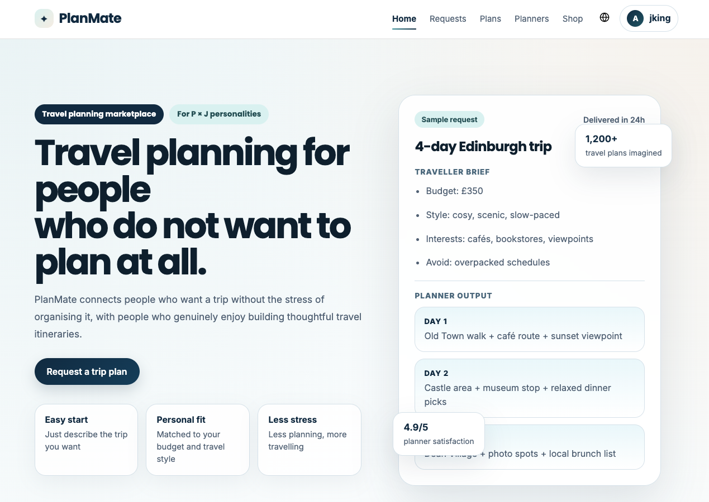

# PlanMate Backend 🚀



Backend API for PlanMate, a travel marketplace platform connecting travellers with planners.

👉 Live Demo: https://planmate-front.onrender.com  
👉 Front-end Code: https://github.com/YuSangGon/planmate-front

---

## ✨ Features

- JWT-based authentication & authorization
- Travel request & planner matching system
- Work plan creation and submission workflow
- Plan preview & approval system
- Coin-based payment system
- Review & rating system
- Real-time chat (Socket.io)
- Transaction-safe operations with Prisma

---

## 💡 About the Project

- Stateful workflow (draft → submitted → approved → completed)
- Atomic transactions for payments and request completion
- Designed to simulate real-world service architecture

---

## 🛠 Tech Stack

- Node.js
- Express
- TypeScript
- Prisma ORM
- PostgreSQL
- Socket.io
- Zod (validation)

---

## 🚀 Getting Started

```bash
npm install
npx prisma generate
npx prisma migrate dev
npm run dev
```

## 🔗 Environment Variables

Create a .env file in the root directory:

DATABASE_URL=your_postgres_url
JWT_SECRET=your_secret
CORS_ORIGIN=http://localhost:5173

---

## 📂 Project Structure

```bash
src/
├── controllers/    # route handlers
├── services/       # business logic
├── routes/         # API routes
├── middlewares/    # auth & error handling
├── lib/            # prisma, socket, etc.
├── config/         # environment config
└── types/          # type definitions
```

## 🗄 Prisma Schema

```bash
prisma/schema.prisma
```
